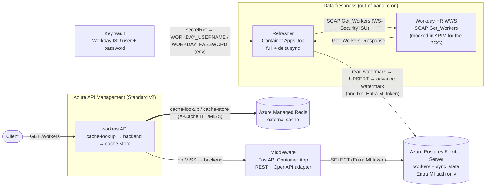

# Workday → Postgres → Middleware → APIM (passive Redis caching)

A split, component-based architecture for serving a cached **Workday** worker
subset through **Azure API Management (Standard v2)**:

1. A **Refresher** (Container Apps Job, cron) pulls workers from **Workday** over
   SOAP (`Get_Workers`) — full **or** delta sync with a watermark — and UPSERTs
   them into **Azure Postgres Flexible Server**.
2. A **Middleware** (FastAPI Container App, "Workday protocol adapter") exposes a
   clean REST + OpenAPI view over the Postgres data.
3. **APIM Standard v2** imports the middleware's OpenAPI and does **standard
   passive request/response caching** (`cache-lookup → backend → cache-store`) on
   an external **Azure Managed Redis**.

> The Workday HR endpoint is **mocked inside APIM** for the POC (a static
> `Get_Workers_Response`); a real deploy just repoints the refresher's
> `WORKDAY_SOAP_URL` at the tenant. The previous active pre-fill mechanism (an
> in-APIM refresh branch that wrote straight to Redis) is gone — caching is now
> plain lazy passive caching, and the data-freshness job writes to **Postgres**,
> not to Redis.



_The thick arrow = external-cache I/O through APIM. On a MISS the request falls
through to the middleware backend (a real backend call), unlike the old active
design where a miss returned 503._

## Components

| Component | Resource | Role |
|-----------|----------|------|
| **Refresher** | Container Apps **Job** (cron) | Python ETL: SOAP `Get_Workers` → transform → UPSERT into Postgres. Full + delta (watermark) sync. Reads Workday ISU creds from Key Vault (injected as startup env vars). Postgres via Entra MI token. See [`refresher/README.md`](refresher/README.md). |
| **Middleware** | Container **App** (external ingress) | FastAPI "Workday protocol adapter": `GET /workers`, `GET /workers/{employee_id}`, `GET /healthz`, `GET /readyz`, `GET /openapi.json`, `GET /docs`. Read-only, Postgres via Entra MI token. See [`middleware/README.md`](middleware/README.md). |
| **Postgres** | Azure Postgres Flexible Server | Datastore for `workers` + `sync_state` (the delta watermark). **MI-only auth** (`password_auth_enabled = false`); DB roles: middleware `SELECT`, refresher `SELECT/INSERT/UPDATE/DELETE`. |
| **APIM + Redis** | API Management Std v2 + Azure Managed Redis | APIM imports the middleware OpenAPI, backend = middleware URL, and does passive request/response caching keyed by path + query on the external Redis cache. Also hosts the **mocked Workday SOAP** endpoint. |
| **Key Vault** | Key Vault | Holds the Workday ISU `workday-username` / `workday-password` secrets (values from Terraform vars). The refresher identity has *Key Vault Secrets User*; the platform resolves the secret refs to env vars at job start. |
| **ACR** | Azure Container Registry | Stores the two images `azd` builds/pushes. Container Apps pull via **AcrPull** on their managed identities. |

## Auth model

Three **different** hops, three mechanisms — do not conflate them:

| Hop | Auth | Secret? |
|-----|------|---------|
| Refresher / Middleware → **Postgres** | **Entra managed-identity** access token (audience `ossrdbms`) | **No password** (MI-only) |
| Refresher → **Workday SOAP** | WS-Security **`UsernameToken`** (ISU user + password) | **Yes** → Key Vault (`workday-username` / `workday-password`) |
| Container Apps → **ACR** | Managed identity **`AcrPull`** | No |

## Full vs delta sync + watermark

The refresher chooses a mode via `SYNC_MODE` (`auto` \| `full` \| `delta`, default `auto`):

- **Full** — empty `Request_Criteria`; pages through *all* workers. Used on the
  first run (empty `sync_state`) or when forced with `SYNC_MODE=full`. Re-anchors
  the watermark.
- **Delta** — reads the watermark (`sync_state.last_updated_through`) and asks
  Workday only for records changed since then, via
  `Request_Criteria/Transaction_Log_Criteria/Transaction_Date_Range_Data/Effective_And_Updated_DateTime_Data`
  with **both date pairs** (Workday requires both halves of each pair):
  - **Updated pair** (the *transaction* window — what changed):
    `Updated_From` = watermark − `WATERMARK_LOOKBACK_SECONDS`,
    `Updated_Through` = run start.
  - **Effective pair** (the *effective-date* window the changes apply to):
    `Effective_From` = `EFFECTIVE_FLOOR`,
    `Effective_Through` = run start + `EFFECTIVE_LOOKAHEAD_DAYS`.
- **auto** — delta when a watermark exists, otherwise full.

The UPSERTs and the watermark advance (`last_updated_through`, `last_sync_mode`,
`last_run_at`, `rows_upserted`) commit in **one transaction**, so a failed run
never advances the watermark: it replays the same window next time (at-least-once
+ idempotent UPSERT, contiguous windows ⇒ no gaps).

## Workday `Get_Workers` field mapping

The refresher extracts a lightweight subset per `wd:Worker` (namespace
`urn:com.workday/bsvc`) keyed by **`employeeID`** (primary key), including
`cwid`, `email`, `internalFullName` / `internalFirstName` / `internalLastName`,
`businessAddressSite` (+ `businessAddressSiteID`, `businessAddressCountry`),
`companyCode` / `companyName`, `costCenter`, `countryCode`, and a derived
`active` flag. Primary job is selected with `wd:Worker_Job_Data[@wd:Primary_Job=1]`
and work email with the `WORK` usage filter.

> The full canonical XPath table (and the `workers` / `sync_state` DDL) lives in
> [`plan.md` §5](plan.md). The middleware serves the same subset as camelCase
> JSON — see [`middleware/README.md`](middleware/README.md).

## Deploy

Both paths run the same Terraform in `infra/`; `azd` only injects
`environment_name` / `location` / `subscription_id` via `infra/main.tfvars.json`.

### Required inputs

| Input | How to supply | Notes |
|-------|---------------|-------|
| `workday_username`, `workday_password` | `TF_VAR_workday_username` / `TF_VAR_workday_password` env vars, or a (never-committed) `*.tfvars` | The Workday **ISU** credentials. Terraform stores them as **Key Vault** secrets; the refresher gets them as env vars at startup. |
| `entra_admin_object_id` | `TF_VAR_entra_admin_object_id` or tfvars | Object id of the Entra principal made **Postgres AAD admin** (usually the deployer). Needed to bootstrap the MI DB roles. Leave unset only for offline `terraform validate`. |
| `workday_soap_url` *(optional)* | `TF_VAR_workday_soap_url` or tfvars | Real Workday `Human_Resources` WWS endpoint. **Empty ⇒ use the in-APIM SOAP mock** (the POC default). |

```bash
# Supply the Workday ISU creds + the Postgres Entra admin (the deployer here):
export TF_VAR_workday_username='isu_integration@tenant'
export TF_VAR_workday_password='<isu-password>'
export TF_VAR_entra_admin_object_id="$(az ad signed-in-user show --query id -o tsv)"
# export TF_VAR_workday_soap_url='https://<host>/ccx/service/<tenant>/Human_Resources/v46.2'  # optional; empty => in-APIM mock
```

### Option A — azd (wrapper)

```bash
azd auth login
azd up            # prompts for env name / region / subscription, then builds images + runs Terraform
```

On `azd up` / `azd provision`, azd also **prompts** whether to enable the optional
private-networking topology (the `ENABLE_PRIVATE_NETWORKING` infrastructure
parameter, wired in `infra/main.tfvars.json`). Answer `false` (default behaviour —
all-public build) or `true` (VNet + private endpoints; see [Optional: private
networking](#optional-private-networking)). To skip the prompt on future runs, pin
it in the azd environment:

```bash
azd env set ENABLE_PRIVATE_NETWORKING false   # or true
```

### Option B — Terraform (no azd)

```bash
cd infra
export ARM_SUBSCRIPTION_ID=<your-sub-id>     # or set subscription_id in tfvars
terraform init
terraform apply -var environment_name=demo -var location=westeurope \
  -var enable_private_networking=false       # true => VNet + private endpoints
```

> **Apply-time ordering:** APIM imports the middleware's `/openapi.json` at
> provision time, so the middleware image must already be **built and serving**
> when the `workers` API import runs. `azd up` builds/pushes the images before
> the provision that does the import (build → provision), so this is handled. With
> plain Terraform, make sure the middleware is deployed and reachable first (deploy
> the middleware image, then `apply` — re-run `apply` if the first import raced the
> image).

> APIM Standard v2 provisions in a few minutes. State is local by default —
> configure a remote backend for team/production use.

## Test the cache

```bash
scripts/smoke-test.sh     # run refresher job → warm the cache (MISS) → HIT, all via Terraform outputs
scripts/db-verify.sh      # psql the workers / sync_state rows via an Entra token (Postgres analog of a cache peek)
scripts/flush-cache.sh    # FLUSHALL the Managed Redis to force the next call back to a MISS
```

### Manual MISS → HIT walkthrough

The refresher populates **Postgres**; the *first* APIM read then warms Redis from
the middleware (MISS), and the *second* read is served from Redis (HIT). The
passive-cache policy sets an `X-Cache` response header.

```bash
rg=$(terraform -chdir=infra output -raw RESOURCE_GROUP)
job=$(terraform -chdir=infra output -raw REFRESHER_JOB_NAME)
workers=$(terraform -chdir=infra output -raw WORKERS_ENDPOINT)

# 1. Run the refresher on demand (same thing the cron does) → fills Postgres.
az containerapp job start -g "$rg" --name "$job" -o none
az containerapp job execution list -g "$rg" --name "$job" \
  --query "[0].properties.status" -o tsv          # wait until: Succeeded

# 2. First read warms the cache from the middleware/Postgres.
curl -si "$workers" | grep -i x-cache             # X-Cache: MISS  (HTTP 200)

# 3. Second read is served from Redis.
curl -si "$workers" | grep -i x-cache             # X-Cache: HIT   (HTTP 200)
curl -s  "$workers" | head -c 400; echo           # the cached body
```

## Offline checks (no cloud)

```bash
cd middleware && pytest        # FastAPI adapter (DB layer monkeypatched)
cd refresher  && pytest        # SOAP transform + delta-envelope tests
cd infra      && terraform validate
```

## Configure

Terraform variables (`infra/variables.tf`):

| Variable | Default | Description |
|----------|---------|-------------|
| `environment_name` | — (required) | azd environment name; used to name/tag resources. |
| `location` | — (required) | Azure region, e.g. `westeurope`. |
| `subscription_id` | `null` | Subscription id; `null` ⇒ `ARM_SUBSCRIPTION_ID` / `az login` context. |
| `apim_sku` | `StandardV2_1` | APIM SKU (Standard v2). |
| `publisher_name` | `Contoso` | APIM publisher name. |
| `publisher_email` | `admin@example.com` | APIM publisher email. |
| `redis_sku` | `Balanced_B0` | Azure Managed Redis SKU (cheapest). |
| `cache_ttl_seconds` | `172800` | External-cache TTL (keep > refresh interval). |
| `refresh_cron` | `0 2 * * *` | Refresher Job cron (UTC, 5-field). |
| `workday_username` | — (required, sensitive) | Workday ISU username → Key Vault secret. |
| `workday_password` | — (required, sensitive) | Workday ISU password → Key Vault secret. |
| `workday_soap_url` | `""` | Workday SOAP endpoint; empty ⇒ in-APIM SOAP mock. |
| `postgres_sku` | `B_Standard_B1ms` | Postgres Flexible Server SKU (burstable, cheapest). |
| `postgres_storage_mb` | `32768` | Postgres storage in MB. |
| `entra_admin_object_id` | `null` | Entra principal made Postgres AAD admin; `null` skips admin + role bootstrap. |
| `enable_private_networking` | `false` | **Optional VNet hardening.** `true` ⇒ create a VNet + private endpoints so every backend (middleware, Postgres, Redis, Key Vault, ACR) is private and APIM is the only public ingress. Off ⇒ all-public build (unchanged). Accepts `true/false/yes/no/1/0` (string, so `azd` can prompt for it). |
| `vnet_address_space` | `10.20.0.0/16` | VNet CIDR (only used when private networking is enabled). |
| `apim_integration_subnet_cidr` | `10.20.0.0/24` | APIM outbound-integration subnet (delegated `Microsoft.Web/serverFarms`). |
| `aca_infrastructure_subnet_cidr` | `10.20.4.0/23` | Container Apps infrastructure subnet (delegated `Microsoft.App/environments`; /23 min). |
| `pe_subnet_cidr` | `10.20.8.0/24` | Subnet hosting the private endpoints. |

### Optional: private networking

Set `enable_private_networking = true` to place all backends on a VNet behind private
endpoints, with APIM as the single public entry point (also reachable privately in-VNet).
This is fully opt-in and flag-gated — the default deployment is unaffected.

Caveats when enabled (see `plan.md` §10.5):

- **ACR** is bumped to the **Premium** SKU (required for Private Link) and public access is
  turned off — run the first image build/push before locking it down, or use a VNet-connected
  runner / ACR Tasks.
- **Postgres** public access is off, so the Entra role bootstrap (`local-exec` psql) must run
  from within/peered to the VNet.
- **Key Vault** switches to `network_acls` Deny (`bypass = AzureServices`); the deployer writing
  secrets and Container Apps resolving secret refs must reach it over the VNet.
- **APIM outbound VNet integration** is not yet supported by azurerm ~>4.0; Terraform creates the
  inbound private endpoint and the integration subnet, but enabling outbound integration is a
  one-time post-deploy `az`/portal step (documented in `plan.md` §10).

Refresher-specific tuning (`SYNC_MODE`, `WATERMARK_LOOKBACK_SECONDS`, `PAGE_COUNT`,
`EFFECTIVE_FLOOR`, `EFFECTIVE_LOOKAHEAD_DAYS`, `WORKDAY_API_VERSION`) is documented
in [`refresher/README.md`](refresher/README.md).

## Clean up

```bash
azd down --purge        # or: terraform -chdir=infra destroy
```

`--purge` also removes the soft-deleted APIM instance and Key Vault so the names
are reusable.
