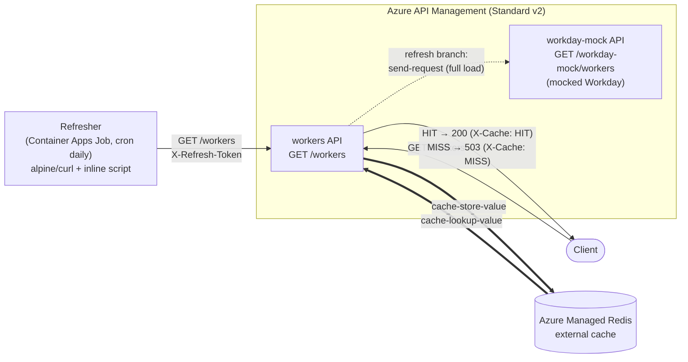

# APIM Active Caching (Standard v2) with Redis pre-filled by a Container App

Azure API Management **Standard v2** serves employee data from an **external
Azure Managed Redis** that is **actively pre-filled** on a schedule by an Azure
**Container Apps Job**. The downstream system is **Workday**, mocked inside APIM.



_Solid double arrows = cache I/O (both through APIM, so keys share APIM's namespace).
Dotted = the refresh-only backend pull._

The **same `workers` API** does both jobs. A normal client `GET /workers` only reads
Redis (HIT/503). When the scheduled job calls `GET /workers` **with the secret
`X-Refresh-Token` header**, a refresh branch fires: APIM pulls a full load from the
(mocked) Workday backend and writes it into Redis with `cache-store-value`. There is no
separate cache-admin API — folding the write into the read API removes it.

## Active vs passive caching

Passive caching populates the cache lazily on the first request (`cache-lookup`/
`cache-store` around a backend). **Active caching** keeps the cache warm out-of-band:
here the request path (`GET /workers`) *only* reads Redis and never touches the
backend — a cache miss is a 503, not a backend call. A separate Container Apps Job
pushes fresh data on a cron, so the data is always there before anyone asks.

### Why the write goes through APIM (not straight to Redis)

APIM's key layout for `cache-store-value`/`cache-lookup-value` on an external cache
is **undocumented and prefixed internally** (a key `products:all` is stored in Redis as
`1_products:all`), so an external process writing raw keys to Redis cannot reliably be
read back by APIM. The refresh branch therefore does the `cache-store-value` **inside
APIM**, so writer and reader share APIM's key namespace. This is the official
[cache-by-key](https://learn.microsoft.com/azure/api-management/api-management-sample-cache-by-key)
pattern (lookup → on miss send-request → cache-store), except the store is gated on the
refresh token instead of a user miss — so users are always served warm, never from a
cold-fill roundtrip.

## Workday API notes (what the mock is based on)

Real Workday exposes worker data a few ways; the mock imitates the REST shape:

| API | Endpoint (shape) | Notes |
|-----|------------------|-------|
| **Staffing REST** | `GET /ccx/api/staffing/v6/{tenant}/workers` | Modern REST. Returns `{ "total": n, "data": [ { "id", "descriptor", ... } ] }`. OAuth 2.0 bearer token. |
| **Common REST** | `GET /ccx/api/v1/{tenant}/workers` | Same `total` + `data[]` collection envelope used across Workday REST. |
| **RaaS** | `GET /ccx/service/customreport2/{tenant}/{report}?format=json` | "Report as a Service" — custom reports exposed as JSON/CSV. Common for bulk extracts. |
| **SOAP (HCM)** | `Human_Resources / Get_Workers` | Legacy but complete; page via `Response_Filter`. |

All are **paginated** (`total`, `page`/`offset`, `limit`) and require per-tenant auth.
For this POC the cache holds a **lightweight subset** — `company`, `contact`, and
`location` per worker — since that is all the consuming API needs.
`infra/data/workers.json` mirrors the `{ "total", "data": [ worker ] }` REST envelope
with fields `workerId`, `company` `{id,name}`, `contact` `{name,email,phone}`, and
`location` `{id,name,country}`. Edit that file to change what the mock (and therefore
the cache) returns.

## Deploy

### Option A — azd (wrapper)

```bash
azd auth login
azd up            # prompts for env name, region, subscription; runs the Terraform below
```

### Option B — Terraform (independent, no azd)

```bash
cd infra
export ARM_SUBSCRIPTION_ID=<your-sub-id>     # or set subscription_id in tfvars
terraform init
terraform apply -var environment_name=demo -var location=westeurope
```

Both paths use the same Terraform in `infra/`. azd only injects
`environment_name`/`location`/`subscription_id` via `infra/main.tfvars.json`.

> APIM Standard v2 provisions in a few minutes. State is local by default —
> configure a remote backend for team/production use.

## Test the caching

```bash
scripts/smoke-test.sh     # MISS → trigger job → HIT, all via Terraform outputs
scripts/flush-cache.sh    # FLUSHALL the Redis (installs redis-cli if needed) to force a MISS/503
```

### Flush → 503 → refresh job → HIT (the failure/recovery test)

This proves the API serves *only* from cache: empty the Redis, watch it fail, run
the refresher job, watch it recover.

```bash
gw=$(terraform -chdir=infra output -raw APIM_GATEWAY_URL)
rg=$(terraform -chdir=infra output -raw RESOURCE_GROUP)
job=$(terraform -chdir=infra output -raw REFRESHER_JOB_NAME)

# 1. Empty the cache
scripts/flush-cache.sh
curl -si "$gw/workers" | grep -i x-cache        # X-Cache: MISS  → HTTP 503 (no data)

# 2. Run the refresher job on demand (same thing the daily cron does)
az containerapp job start -g "$rg" --name "$job"
az containerapp job execution list -g "$rg" --name "$job" -o table   # wait for Succeeded

# 3. Cache is warm again
curl -si "$gw/workers" | grep -i x-cache        # X-Cache: HIT  → HTTP 200
```

Or trigger the refresh without the job, using the token directly (what the job
does internally):

```bash
gw=$(terraform -chdir=infra output -raw APIM_GATEWAY_URL)
tok=$(terraform -chdir=infra output -raw REFRESH_TOKEN)

curl -si "$gw/workers" | grep -i x-cache        # X-Cache: MISS (before the job runs)

# Trigger a refresh (what the cron job does): pull a full load into Redis
curl -si "$gw/workers" -H "X-Refresh-Token: $tok" | grep -i x-cache   # X-Cache: REFRESHED

curl -si "$gw/workers" | grep -i x-cache        # X-Cache: HIT
curl -s  "$gw/workers"                          # workers served from Redis
```

## Configure

Terraform variables (`infra/variables.tf`): `apim_sku` (default `StandardV2_1`),
`refresh_cron` (`0 2 * * *`, daily full load), `cache_ttl_seconds` (`172800` = 2 days,
keep > refresh interval), `cache_key` (`workers-all`), `redis_sku` (`Balanced_B0` —
cheapest Azure Managed Redis).

## Offline check

```bash
python3 refresher/test_refresh.py    # verifies refresh.sh's ETL without any cloud
```

## Clean up

```bash
azd down --purge        # or: terraform -chdir=infra destroy
```

`--purge` also removes the soft-deleted APIM instance so the name is reusable.

## Deliberately skipped (add when needed)

- **Custom refresher image / ACR** — a public `alpine/curl` + inline script is enough; add an ACR image if Docker Hub rate limits bite or you need real ETL logic.
- **App Insights / APIM diagnostics** — Log Analytics captures job logs; wire APIM telemetry when you need request tracing.
- **VNet, private endpoints, AAD on the refresh branch** — the refresh branch is gated by a shared token and the mock runs public; add a VNet + `validate-azure-ad-token` for anything beyond a demo.
- **Remote Terraform state** — local state is fine for a throwaway; use an azurerm backend for teams.
