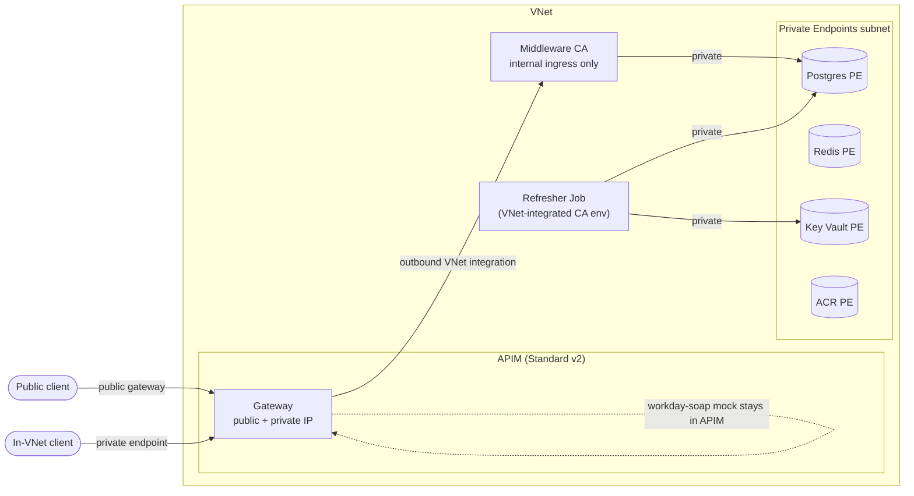

# Restructure Plan — Workday → Postgres → Middleware → APIM (passive Redis caching)

> Status: **PLAN ONLY — no implementation yet.** This file describes the target
> architecture, the Terraform module layout, the Key Vault / managed-identity
> auth model, and the Workday `Get_Workers` contract the refresher consumes.
> Nothing here is built until approved.

## 1. Why we are restructuring

The current design folds everything into APIM: the `workers` API's refresh branch
pulls a full load from an in-APIM Workday mock and `cache-store-value`s it into
Redis (the "active cache" fragment). The refresher is just `alpine/curl` hitting
APIM with an `X-Refresh-Token`. There is no database, no real ETL, and no separate
adapter.

We are splitting this into **independent components** with a real datastore:

```
   ┌──────────┐  KV secret refs resolved to
   │ Key Vault│  ENV VARS at container startup
   │ WD creds │  (refresher identity, not Workday)
   └────┬─────┘
        │ WORKDAY_USERNAME / WORKDAY_PASSWORD (env)
        ▼                (cron)
┌──────────────┐  SOAP Get_Workers   ┌───────────────────────────────┐
│  Workday     │◄────────────────────│  Refresher (Container Apps Job)│
│  (HR WWS)    │   WS-Security ISU    │  full + DELTA (watermark) sync │
│  mock or real│────────────────────►│  SOAP → transform → UPSERT     │
└──────────────┘   Get_Workers_Resp  │  (Python: httpx + lxml)        │
                                     └───────────────┬────────────────┘
                                                     │ psycopg (Entra MI token)
                                                     │ read/write watermark + UPSERT
                                                     ▼
                                          ┌────────────────────────┐
                                          │ Azure Postgres Flexible│
                                          │ Server (MI auth ONLY)  │
                                          │ workers + sync_state   │
                                          └───────────┬────────────┘
                                                      │ SELECT (Entra MI token)
                                          ┌───────────▼────────────────┐
                                          │ Middleware (Container App)  │
                                          │ Workday protocol adapter    │
                                          │ REST + OpenAPI (FastAPI)    │
                                          └───────────┬─────────────────┘
                        client ──► APIM (Std v2) ─────┘
                                     │ cache-lookup-value → backend → cache-store-value
                                     ▼
                              Azure Managed Redis (external cache)
```

The **Key Vault is linked to the refresher** (its managed identity), not to
Workday. Secrets are the Workday **ISU credentials** the refresher presents to the
Workday SOAP endpoint.

Key behavioral change: **caching becomes standard passive request/response
caching** (lookup → on miss call backend → store), not the active pre-fill. The
data freshness job (refresher) now writes to **Postgres**, not to Redis.

## 2. Components

### 2.1 Refresher (rewritten) — Container Apps Job, cron
- Language: **Python** (`httpx` for SOAP POST, `lxml` for parsing, `psycopg[binary]` for Postgres).
- **Credentials as startup env vars, not per-request fetch:** the Workday ISU
  `username`/`password` are wired as Container Apps **Key Vault secret references**
  that resolve to the container's **secrets at startup**, then surfaced as env vars
  `WORKDAY_USERNAME` / `WORKDAY_PASSWORD`. The app just reads `os.environ` — no
  Key Vault SDK call on the hot path, no fetch per SOAP request. (Platform refreshes
  the secret material on job start / revision; each cron execution is a fresh start.)
- **Two sync modes** (chosen by `SYNC_MODE` env / arg, default `auto`):
  - **Full sync** — no criteria: page through *all* workers. Used on first run
    (empty `sync_state`) or when forced (`SYNC_MODE=full`).
  - **Delta sync** — reads the **watermark** from `sync_state` (see §5.1) and asks
    Workday only for records changed since then, via
    `Request_Criteria/Transaction_Log_Criteria/Transaction_Date_Range_Data/Effective_And_Updated_DateTime_Data`
    supplying **both** date pairs (Workday requires both halves of each, and the
    expert confirms both pairs are needed):
    `Updated_From` = watermark, `Updated_Through` = run start time (the *transaction*
    window — what changed), **and** `Effective_From` / `Effective_Through` (the
    *effective-date* window the changes apply to). Far smaller payloads on routine
    cron runs.
  - `auto` = full when no watermark exists, otherwise delta.
- On each cron run:
  1. Read `WORKDAY_USERNAME`/`WORKDAY_PASSWORD` from env (already injected from KV).
  2. Read watermark from `sync_state` (Postgres, Entra MI token).
  3. Build a `Get_Workers_Request` SOAP envelope (WS-Security `UsernameToken`); for
     delta, add the `Updated_From`/`Updated_Through` window. Page through results
     (`Response_Filter` Page/Count) until `Total_Pages`.
  4. Transform each `Worker` → normalized row (see §5 mapping).
  5. `INSERT ... ON CONFLICT (worker_id) DO UPDATE` (UPSERT) into `workers`.
  6. **Advance the watermark**: on success, set `sync_state.last_updated_through` =
     the run's `Updated_Through` (the query upper bound), plus `last_sync_mode`,
     `last_run_at`, `rows_upserted`. Written in the **same transaction** as the
     UPSERTs so a failed run never advances the watermark (at-least-once, replayable).
- Connects to Postgres with an **Entra managed-identity access token** (no DB password).
- No APIM, no Redis, no `X-Refresh-Token` anymore.
- Keep an **offline ETL test** (`refresher/tests/test_transform.py`) that parses `infra/modules/apim/data/workers-soap.xml` and asserts the mapped rows, **plus** a test that builds a delta request envelope from a given watermark — runs with no cloud.

### 2.2 Middleware (new) — Container App, always-on HTTP service
- Language: **Python / FastAPI** (auto OpenAPI at `/openapi.json`, docs at `/docs`).
- "Workday protocol adapter": exposes clean REST over the cached Workday subset.
  - `GET /workers` → list (supports `?limit&offset`), `GET /workers/{employee_id}` → one, `GET /healthz` → liveness.
- Reads Postgres with an **Entra managed-identity token** (no DB password).
- External ingress; APIM points its backend here and imports `/openapi.json`.

### 2.3 APIM (simplified) — Standard v2
- Import the middleware **OpenAPI** as the backing API (backend = middleware Container App URL).
- Replace the active-cache fragment with **standard request/response caching**:
  `cache-lookup-value` (vary by URL/query) → on MISS call middleware → `cache-store-value` with `CacheTtlSeconds` → return. Redis stays as the **external cache**.
- **Remove:** `policies/active-cache.fragment.xml`, `policies/workers-cache-read.xml`, and named values `RefreshToken`, `CacheKey`, `WorkdayBackendUrl`.
- **Keep:** the SOAP Workday **mock** (`workday-mock-soap`) so the refresher has a Workday endpoint to call in the POC (real deploy just repoints the refresher's `WORKDAY_SOAP_URL`).

### 2.4 Datastore (new) — Azure Postgres Flexible Server
- SKU `B_Standard_B1ms` (burstable, cheapest). One database `workday`.
- **Entra / managed-identity authentication ONLY** — `password_auth_enabled = false`, `active_directory_auth_enabled = true`.
- Both the middleware and refresher user-assigned identities are provisioned as **Entra DB principals** with least privilege (middleware: `SELECT`; refresher: `SELECT/INSERT/UPDATE/DELETE`).

## 3. Terraform module layout (new)

Refactor the flat `infra/main.tf` into composable modules under `infra/modules/`.
`infra/main.tf` becomes the **root/composition** that wires modules together and
passes variables.

```
infra/
  main.tf              # root: providers wiring + module composition + IAM glue
  variables.tf         # root vars (env, location, skus, workday creds, cron, ttl…)
  outputs.tf           # aggregated outputs from modules
  provider.tf          # azurerm/random providers (unchanged)
  main.tfvars.json     # azd injects environment_name/location/subscription_id
  modules/
    network/           # OPTIONAL VNet: subnets, private DNS zones (gated by enable_private_networking)
    naming/            # suffix + base name + tags (random_string) — single source
    keyvault/          # Key Vault + Workday ISU user/pass secrets + access policy/RBAC
    identity/          # user-assigned managed identities (middleware, refresher)
    postgres/          # Flexible Server (MI-only auth), database, Entra admin, roles
    registry/          # Azure Container Registry (for the two images)
    redis/             # Azure Managed Redis (external cache) — extracted as-is
    apim/              # APIM Std v2, external cache wiring, OpenAPI import, cache policy
      data/            #   workers.json, workers-soap.xml (moved here)
      policies/        #   passive-cache policy + soap mock templates
    containerapps/     # CA environment + middleware app + refresher job (+ Log Analytics)
```

Module dependency / data flow:
`naming` → everything (names/tags).
`keyvault` ← `identity` (grant refresher identity `get` on secrets).
`postgres` ← `identity` (register MIs as DB principals).
`registry` ← `identity` (grant `AcrPull`).
`containerapps` ← `identity`, `registry`, `postgres`, `keyvault`, `redis` outputs.
`apim` ← `redis` (cache), `containerapps` (middleware backend URL / OpenAPI).

Each module: its own `variables.tf`, `outputs.tf`, `main.tf`. Root composes them
and owns cross-module IAM (role assignments) to avoid cycles.

## 4. Key Vault + auth model (the crux of this change)

Two **different** auth mechanisms — do not conflate them:

| Hop | Auth | Secret? |
|-----|------|---------|
| Refresher/Middleware → **Postgres** | **Entra managed identity** access token | **No password** (MI-only) |
| Refresher → **Workday SOAP** | WS-Security **UsernameToken** (ISU user + password) | **Yes** → Key Vault |
| Container Apps → **ACR** | Managed identity `AcrPull` | No |

- **`keyvault` module** creates the vault and two secrets — `workday-username` and
  `workday-password` — whose **values come from Terraform variables** (`var.workday_username`,
  `var.workday_password`, both `sensitive`). No hardcoding.
- The **refresher's user-assigned identity** gets `Key Vault Secrets User` (RBAC) so the
  **Container Apps platform** can resolve the secrets. The two secrets are wired as
  Container Apps **Key Vault secret references** (`secretRef` with `keyVaultUrl` +
  `identity`) and mapped to **env vars** `WORKDAY_USERNAME` / `WORKDAY_PASSWORD`.
  They are resolved **at container startup** (each cron execution is a fresh start),
  so the app reads them from `os.environ` — **no Key Vault SDK call and no per-request
  fetch**. (If runtime rotation without a restart is ever required, switch to the
  `azure-identity` + `azure-keyvault-secrets` SDK; not needed here.)
- Postgres has **no** admin password anywhere; `password_auth_enabled = false`.

Variables to add (root `variables.tf`):
```hcl
variable "workday_username"  { type = string, sensitive = true }  # ISU, e.g. isu_integration@tenant
variable "workday_password"  { type = string, sensitive = true }
variable "workday_soap_url"  { type = string, default = "" }       # "" → use in-APIM SOAP mock
variable "postgres_sku"      { type = string, default = "B_Standard_B1ms" }
variable "postgres_storage_mb" { type = number, default = 32768 }
variable "entra_admin_object_id" { type = string, default = null } # deployer as PG Entra admin
# kept: apim_sku, redis_sku, cache_ttl_seconds, refresh_cron, publisher_name/email
# removed: RefreshToken-related (no longer a variable/named value)
```
azd/TF supply `workday_username`/`workday_password` via `TF_VAR_*` env or tfvars
(never committed).

## 5. Workday `Get_Workers` contract (from v46.2 docs)

- **Service:** `Human_Resources` WWS, operation **`Get_Workers`**, namespace
  `urn:com.workday/bsvc`. Endpoint pattern:
  `https://{host}/ccx/service/{tenant}/Human_Resources/v46.2`.
- **Auth:** SOAP header **WS-Security `UsernameToken`** — username `ISU@tenant`,
  password = ISU password (the Key Vault secrets).
- **Request** `Get_Workers_Request`:
  - `Request_Criteria` → `Worker_Request_Criteria`. **Full sync**: empty criteria =
    all workers. **Delta sync** (see §5.1): set
    `Transaction_Log_Criteria/Transaction_Date_Range_Data/Effective_And_Updated_DateTime_Data`
    with **all four** bounds — `Updated_From`/`Updated_Through` (the transaction window,
    driven by the watermark) **and** `Effective_From`/`Effective_Through` (the
    effective-date window). Workday validation requires that *if either half of a pair
    is set, both are*, so we always send complete Effective **and** Updated pairs
    (per expert guidance). This returns only workers with transactions updated in the
    Updated window whose changes are effective within the Effective window.
  - `Response_Filter` → **paging**: `Page` (1-based) and `Count` (page size, max 999).
    Loop `Page` from 1 while `Page <= Total_Pages` from the response.
  - `Response_Group` → **which data to include** flags. To satisfy the mappings above
    we set `Include_Reference` (Employee_ID), `Include_Personal_Information`
    (names, email, **Identification_Data/Custom_ID** for CWID),
    `Include_Employment_Information` (primary-job Position/Business_Site) and
    `Include_Organizations` (Company/Cost_Center orgs). `countryCode` relies on a
    configured **Integration Field Override**, not a response-group flag.
- **Response** `Get_Workers_Response`:
  - `Response_Results` → `Total_Results`, `Total_Pages`, `Page_Results`, `Page`
    (drives the paging loop).
  - `Response_Data` → `Worker[]` → each `Worker` has `Worker_Reference`
    (WID + `Employee_ID`) and `Worker_Data`:
    - `Worker_ID`, `User_ID`
    - `Personal_Data` → `Name_Data/Legal_Name_Data` (first/last),
      `Contact_Data` → `Email_Address_Data`, `Phone_Data`, `Address_Data`
      (→ `location` country/city).
    - `Employment_Data` → `Worker_Job_Data/Position_Data` (title).
    - `Organization_Data` → the worker's `Company`/`Cost_Center`/`Supervisory` orgs
      (→ `company` id/name).

### Mapping to the cached subset (canonical field XPaths)

Namespace prefix `wd` = `urn:com.workday/bsvc`. The refresher extracts these fields
per `wd:Worker`. `employee_id` is the **primary key** (`Worker_Reference` Employee_ID);
`cwid` is the secondary Custom ID. Primary job is selected with
`wd:Worker_Job_Data[@wd:Primary_Job=1]`; work email with the `WORK` usage filter.

| Column (JSON key)        | Type        | Workday XPath (relative to `wd:Worker`) |
|--------------------------|-------------|------------------------------------------|
| `employeeID` (**PK**)    | text        | `wd:Worker_Reference/wd:ID[@wd:type='Employee_ID']` |
| `cwid`                   | text        | `wd:Worker_Data/wd:Personal_Data/wd:Identification_Data/wd:Custom_ID/wd:Custom_ID_Data[wd:Custom_ID_Type_Reference/wd:ID[@wd:type='Custom_ID_Type_ID']='CWID']/wd:ID` |
| `email`                  | text        | `wd:Worker_Data/wd:Personal_Data/wd:Contact_Data/wd:Email_Address_Data[wd:Usage_Data/wd:Type_Data/wd:Type_Reference/wd:ID='WORK']/wd:Email_Address` |
| `internalFullName`       | text        | `wd:Worker_Data/wd:Personal_Data/wd:Name_Data/wd:Preferred_Name_Data/wd:Name_Detail_Data/wd:Formatted_Name` |
| `internalFirstName`      | text        | `wd:Worker_Data/wd:Personal_Data/wd:Name_Data/wd:Preferred_Name_Data/wd:Name_Detail_Data/wd:First_Name` |
| `internalLastName`       | text        | `wd:Worker_Data/wd:Personal_Data/wd:Name_Data/wd:Preferred_Name_Data/wd:Name_Detail_Data/wd:Last_Name` |
| `businessAddressSite`    | text        | `wd:Worker_Data/wd:Employment_Data/wd:Worker_Job_Data[@wd:Primary_Job=1]/wd:Position_Data/wd:Business_Site_Summary_Data/wd:Name` |
| `businessAddressSiteID`  | text        | `…/wd:Business_Site_Summary_Data/wd:Location_Reference/wd:ID[@wd:type='Location_ID']` |
| `businessAddressCountry` | text        | `…/wd:Business_Site_Summary_Data/wd:Address_Data/wd:Country_Reference/wd:ID[@wd:type='ISO_3166-1_Alpha-2_Code']` |
| `companyCode`            | text        | `wd:Worker_Data/wd:Employment_Data/wd:Worker_Job_Data[@wd:Primary_Job=1]/wd:Position_Organizations_Data/wd:Position_Organization_Data/wd:Organization_Data[wd:Organization_Type_Reference/wd:ID='Company']/wd:Organization_Code` |
| `companyName`            | text        | `…/wd:Organization_Data[wd:Organization_Type_Reference/wd:ID='Company']/wd:Organization_Name` |
| `costCenter`             | text        | `…/wd:Organization_Data[wd:Organization_Type_Reference/wd:ID='Cost_Center']/wd:Organization_Code` |
| `countryCode`            | text        | `wd:Worker_Data/wd:Integration_Field_Override_Data[wd:Field_Reference/wd:ID[@wd:parent_id='Sailpoint_AdditionalService']='Company_Address_Country']/wd:Value` |
| `active`                 | bool        | derived (present in latest pull) |
| `updated_at`             | timestamptz | `now()` at UPSERT |

> Notes: `…` continues the primary-job path
> `wd:Worker_Data/wd:Employment_Data/wd:Worker_Job_Data[@wd:Primary_Job=1]/wd:Position_Data`
> (Business_Site rows) or `…/wd:Position_Organizations_Data/wd:Position_Organization_Data`
> (org rows). Email is filtered to the `WORK` usage type; company/cost-center rows are
> filtered by `Organization_Type_Reference/wd:ID`. `countryCode` comes from a Workday
> **Integration Field Override** (`Sailpoint_AdditionalService` → `Company_Address_Country`),
> so it only appears when that override is configured on the report/service.

### Postgres schema (bootstrap by refresher/middleware or a migration)
```sql
CREATE TABLE IF NOT EXISTS workers (
  employee_id             text PRIMARY KEY,   -- Worker_Reference Employee_ID
  cwid                    text,               -- Custom ID (CWID)
  email                   text,               -- WORK email
  internal_full_name      text,               -- Preferred name (formatted)
  internal_first_name     text,
  internal_last_name      text,
  business_address_site   text,               -- primary-job business site name
  business_address_site_id text,              -- Location_ID
  business_address_country text,              -- ISO 3166-1 alpha-2
  company_code            text,               -- primary-job Company org code
  company_name            text,
  cost_center             text,               -- primary-job Cost_Center org code
  country_code            text,               -- integration field override
  active                  boolean NOT NULL DEFAULT true,
  updated_at              timestamptz NOT NULL DEFAULT now()
);

-- Single-row (or per-entity) sync watermark the refresher reads/advances.
CREATE TABLE IF NOT EXISTS sync_state (
  entity                text PRIMARY KEY DEFAULT 'workers',
  last_updated_through  timestamptz,     -- watermark: exclusive upper bound of last successful pull
  last_sync_mode        text,            -- 'full' | 'delta'
  last_run_at           timestamptz,
  rows_upserted         integer
);
```

## 5.1 Delta fetch + watermark

- The **watermark** (`sync_state.last_updated_through`) records the `Updated_Through`
  timestamp of the **last successful** pull. It is the single source of truth telling
  the refresher "from what date/time to fetch next". A delta run supplies **both** the
  Updated pair (from the watermark) **and** the Effective pair (see below) —
  `Effective_And_Updated_DateTime_Data` needs both pairs complete.
- Each run:
  1. `SELECT last_updated_through FROM sync_state WHERE entity='workers'`.
  2. Decide mode (`auto`): **full** if the row/watermark is `NULL` (first run or after
     a reset); **delta** otherwise.
  3. `now_utc = run start`. For delta, query Workday with:
     - **Updated window:** `Updated_From = last_updated_through`,
       `Updated_Through = now_utc` (what changed since last run).
     - **Effective window:** `Effective_From` / `Effective_Through`. Default covers
       everything currently in effect: `Effective_From = EFFECTIVE_FLOOR`
       (a fixed floor, e.g. `1900-01-01`) and `Effective_Through = now_utc +
       EFFECTIVE_LOOKAHEAD_DAYS` (default `0` = through now; increase to also catch
       future-dated changes). Both configurable — see vars below.
  4. UPSERT returned workers **and** `UPDATE sync_state SET last_updated_through = now_utc,
     last_sync_mode=…, last_run_at=now(), rows_upserted=…` in **one transaction**.
- **Correctness properties:**
  - **Atomic advance** — watermark only moves if the whole run commits; a crash mid-run
    replays the same window next time (at-least-once; UPSERT makes it idempotent).
  - **No gaps** — next `Updated_From` = previous `Updated_Through` (contiguous windows).
    The Effective window is independent of the watermark (it bounds *which* effective
    state to read, not *since when* changes occurred).
  - **Small overlap by design** — a tiny safety lookback (`WATERMARK_LOOKBACK_SECONDS`,
    default e.g. 60s) can be subtracted from `Updated_From` to tolerate Workday
    transaction-commit clock skew; duplicates are harmless due to UPSERT.
  - **Force full** — `SYNC_MODE=full` (or truncating `sync_state`) ignores the watermark
    and rebuilds from scratch, then re-anchors it.
- New env/vars for the refresher: `SYNC_MODE` (`auto`|`full`|`delta`, default `auto`),
  `WATERMARK_LOOKBACK_SECONDS` (default `60`), `PAGE_COUNT` (default `100`),
  `EFFECTIVE_FLOOR` (default `1900-01-01`), `EFFECTIVE_LOOKAHEAD_DAYS` (default `0`).

## 6. azd / build plumbing

- Add **ACR** (`registry` module) and two `azure.yaml` **services** — `middleware`
  (host: containerapp) and `refresher` (host: containerapp job) — so `azd up`
  builds/pushes both images then Terraform deploys.
- Container Apps pull from ACR via **`AcrPull`** on their managed identities.
- `azure.yaml` gains `services:` with `language: python`, `docker` build context in
  `middleware/` and `refresher/`.

## 7. Files added / changed / removed

**Added**
- `middleware/` (FastAPI app, Dockerfile, requirements, tests)
- `refresher/app/…` (rewritten Python ETL), `refresher/Dockerfile`, `refresher/requirements.txt`, `refresher/tests/`
- `infra/modules/{naming,keyvault,identity,postgres,registry,redis,apim,containerapps}/`
- `infra/modules/network/` (**optional** private-networking: VNet, 3 subnets, 5 private DNS zones — all gated by `enable_private_networking`, no-op by default)

**Changed**
- `infra/main.tf` → module composition; `infra/variables.tf` / `outputs.tf` reworked
- Optional networking wired into root + every service module (see §10): root adds
  `enable_private_networking` + CIDR vars and `module "network"`; postgres/redis/keyvault/registry
  each gain a private endpoint + public-access gating; apim gains an inbound PE (Gateway) +
  documented outbound integration; containerapps gains an internal environment + internal
  middleware ingress. All flag-gated — default (flag off) is byte-for-byte the public build.
- `azure.yaml` → add `services:` (+ ACR)
- `scripts/smoke-test.sh` → test passive-cache MISS→HIT via APIM; add a Postgres seed/verify helper
- `README.md` → new architecture, new mermaid, new deploy/test steps
- move `infra/data/*` and mock policy templates under `infra/modules/apim/`

**Removed**
- `infra/policies/active-cache.fragment.xml`, `infra/policies/workers-cache-read.xml`
- `refresher/refresh.sh`, `refresher/test_refresh.py` (replaced by Python app + tests)
- named values `RefreshToken`, `CacheKey`, `WorkdayBackendUrl` and `scripts/flush-cache.sh`
  (no longer relevant to passive caching; optional to keep a Redis flush helper)

## 8. Assumptions / open questions

1. **Keep the in-APIM SOAP mock** as the refresher's Workday source for the POC;
   real deploy sets `workday_soap_url` to the tenant endpoint. (Assumed yes.)
2. **Managed identity** = **user-assigned** identities (one per component) for
   stable pre-provisioning of Postgres Entra roles. (Assumed yes.)
3. Postgres Entra **admin** = the deploying principal (`entra_admin_object_id`), used
   once to `CREATE ROLE`/`GRANT` the two MIs. Automated via a `local-exec`/`psql`
   bootstrap or `azuread`/`postgresql` provider. (Needs confirmation on approach.)
4. Redis stays as APIM external cache (v2 has no built-in cache). (Assumed yes.)
5. Workday `Response_Group` flag set kept minimal (personal + employment + orgs).
   Widen if more fields are needed later.
6. **Delta is the routine mode** (`auto`): first run does a full sync and seeds the
   watermark; subsequent cron runs pull only `Updated_From=watermark`. Deletes/inactivations
   in Workday surface through the transaction log within the delta window; a periodic full
   reconcile (e.g. weekly `SYNC_MODE=full`) can be scheduled if full accuracy of the
   `active` flag is required. (Confirm whether a periodic full reconcile is wanted.)

## 9. Suggested implementation order (once approved)

1. `naming` + `identity` + `registry` modules.
2. `keyvault` module (Workday secrets via vars) + refresher KV RBAC.
3. `postgres` module (MI-only auth) + Entra role bootstrap.
4. `middleware` app + Dockerfile + `containerapps` module (middleware first).
5. `refresher` Python ETL: full **and** delta sync, `sync_state` watermark read/advance
   in one transaction; offline transform + delta-envelope tests; wire as CA Job.
6. `apim` module: OpenAPI import + passive cache policy + keep SOAP mock; remove old fragment/named values.
7. `azure.yaml` services, `outputs.tf`, `scripts/`, `README.md`.
8. `terraform validate` / `fmt`; offline refresher test; smoke test doc.
9. **(Optional, §10)** `network` module + `enable_private_networking` flag: private endpoints
   for postgres/redis/keyvault/registry, APIM inbound PE + outbound integration, internal
   Container Apps env. Flag-gated so it can be enabled per-deployment without affecting the
   default public build.

## 10. Networking — all services private behind APIM (VNet)

> **STATUS: IMPLEMENTED — optional, gated by `enable_private_networking` (default `false`).**
> This is an optional hardening pass on top of §2–§9. The default build stays all-public;
> setting `enable_private_networking = true` makes APIM the *only* public entry point and
> pushes every backend service onto a private VNet. Every resource below is `count`/conditional
> gated so the flag-off deployment is byte-for-byte the public build (verified: `terraform
> validate` passes with the flag both off and on).
>
> **Known limitation (APIM outbound integration):** azurerm ~>4.0 does **not** yet model
> Standard v2 *outbound VNet integration* (only classic injection via `virtual_network_type`,
> which Azure rejects on the v2 SKU). The `apim` module therefore creates the **inbound**
> private endpoint in Terraform and documents a one-time post-deploy `az` CLI/portal step to
> enable outbound integration (the `integration_subnet_id` is pre-created and passed in). No
> `azapi` provider was added. Revisit when azurerm adds native v2 outbound support.

### 10.1 Goal / topology

APIM stays **publicly reachable** for API consumers (public gateway keeps working)
**and** is reachable **from inside the VNet**. Everything behind APIM — middleware,
Postgres, Redis, Key Vault, ACR — has **no public endpoint**; it is reachable only
over the VNet. APIM is the single ingress.

Two independent APIM networking features make this work on **Standard v2** (do not
conflate them — they are **one-directional and separate**):

| Feature | Direction | Purpose here |
|---------|-----------|--------------|
| **Outbound VNet integration** | APIM → backends | APIM calls the **private** middleware (internal ingress) over the VNet. Required. |
| **Inbound private endpoint** | clients → APIM | Gives APIM a **private IP** so in-VNet clients reach the gateway privately, while **public access stays enabled** (we do NOT set `publicNetworkAccess=Disabled`). Optional but requested ("also accessible from within a vnet"). |

> **Why we need outbound integration even though "everything is in the VNet":**
> On Standard v2, APIM is **never injected into your VNet** — its compute stays in the
> managed service. The inbound private endpoint is only a NIC that projects APIM's
> *inbound* gateway into a subnet (client → APIM); it does **not** put APIM's *outbound*
> traffic on the VNet. So without outbound VNet integration, APIM has no route to the
> middleware's private IP and the backend call fails. Per
> [virtual-network-concepts](https://learn.microsoft.com/azure/api-management/virtual-network-concepts),
> the inbound private endpoint is *"only inbound"* and v2 VNet integration is
> *"outbound request traffic … to a delegated subnet"* — two halves, neither substitutes
> for the other.
>
> The "same VNet ⇒ one feature, both directions" intuition only holds for **VNet
> injection** (classic Developer/Premium and **Premium v2**), where APIM's compute is
> genuinely in your subnet. Standard v2 does not offer injection; it splits the
> capability into the two gateway-only features above. **Alternative:** if a single
> injected model (inbound + outbound on the VNet, no separate integration) is preferred,
> use **Premium v2 (VNet injection)** — at Premium v2 cost.



### 10.2 VNet + subnets (new `network` module)

One VNet (e.g. `10.20.0.0/16`) with **delegated** subnets — each Azure service that
"injects" needs its own delegated subnet, and private endpoints need a plain subnet:

| Subnet | CIDR (example) | Delegation / use |
|--------|----------------|------------------|
| `snet-apim-out` | `10.20.0.0/24` | APIM Std v2 **outbound VNet integration** — delegation `Microsoft.Web/serverFarms`. |
| `snet-aca` | `10.20.4.0/23` | Container Apps environment **infrastructure** subnet (middleware + refresher). |
| `snet-pe` | `10.20.8.0/24` | **Private endpoints** for Postgres/Redis/KV/ACR (no delegation). |
| `snet-pg` *(alt)* | `10.20.9.0/28` | Only if Postgres uses **VNet-integration** mode instead of a PE — delegation `Microsoft.DBforPostgreSQL/flexibleServers`. |

Plus **Private DNS zones** (linked to the VNet) so private FQDNs resolve to private IPs:
`privatelink.azure-api.net` (APIM), `privatelink.postgres.database.azure.com`,
`privatelink.redis.azure.net` (Managed Redis / redisEnterprise),
`privatelink.vaultcore.azure.net` (Key Vault), `privatelink.azurecr.io` (ACR).

### 10.3 Per-service changes

- **APIM (`apim` module)** — add **outbound VNet integration** into `snet-apim-out`
  (Std v2: the `virtual_network_type`/`virtual_network_configuration` for v2 outbound
  integration). Add an **inbound private endpoint** (sub-resource `Gateway`) in
  `snet-pe` + `privatelink.azure-api.net` A record. **Keep public access ON** (do not
  patch `publicNetworkAccess=Disabled`). Note: the private endpoint covers the
  **gateway only** on Std v2, not the management/portal endpoints.
- **Middleware (`containerapps` module)** — move the Container Apps environment onto
  the VNet (`infrastructure_subnet_id = snet-aca`) and set the environment to
  **internal** (`internal_load_balancer_enabled = true`); middleware ingress becomes
  **internal** (VNet-only). APIM reaches it via outbound integration + the ACA
  environment's private DNS. The refresher job runs in the same VNet-integrated env,
  so its outbound calls (Postgres, Key Vault, Workday) traverse the VNet.
- **Postgres (`postgres` module)** — disable public network access; use **either** a
  **private endpoint** in `snet-pe` (`privatelink.postgres.database.azure.com`) **or**
  private-access VNet integration via `snet-pg`. PE is the cleaner fit alongside the
  others. Middleware + refresher already resolve `PGHOST` — it now resolves to a
  private IP. (MI auth is unchanged.)
- **Redis (`redis` module)** — add a **private endpoint** (`redisEnterprise`) in
  `snet-pe` + `privatelink.redis.azure.net`; set `public_network_access_enabled = false`.
  APIM's external-cache connection string now targets the private FQDN:10000.
- **Key Vault (`keyvault` module)** — add a **private endpoint** + 
  `privatelink.vaultcore.azure.net`; `public_network_access_enabled = false`. The
  refresher resolves KV secret references over the VNet (Container Apps platform +
  the refresher identity). Keep the deployer's access working during `apply` (see
  caveats).
- **ACR (`registry` module)** — add a **private endpoint** + `privatelink.azurecr.io`;
  `public_network_access_enabled = false`. Container Apps pull images over the VNet.
  **Caveat:** `azd`/`az acr build` pushes need network reachability — either build from
  a VNet-connected agent, temporarily allow the deployer IP, or use ACR Tasks. Simplest
  for a POC: keep ACR public during the initial `azd up`, then flip it private.

### 10.4 Terraform / variable changes

- New **`network`** module (VNet, subnets, delegations, private DNS zones + VNet links);
  outputs subnet ids + DNS zone ids consumed by the other modules.
- Each affected module gains inputs (`subnet_id`, `private_dns_zone_id`,
  `enable_private_networking`) and creates its `azurerm_private_endpoint` +
  `azurerm_private_dns_a_record` (or a `private_dns_zone_group`).
- **Feature flag:** a root `var.enable_private_networking` gates the whole thing with
  `count`/`for_each`, so the public POC path keeps working and the private topology is
  opt-in. The variable is declared as a **string** (accepts `true/false/yes/no/1/0`,
  empty ⇒ false) normalised to a real bool in `local.enable_private_networking`, so
  **`azd` can prompt for it**: `infra/main.tfvars.json` maps it to
  `"${ENABLE_PRIVATE_NETWORKING}"`, and azd asks on `azd up`/`provision` when the value
  isn't already in the azd environment (`azd env set ENABLE_PRIVATE_NETWORKING true|false`
  to pin/skip the prompt). Add `var.vnet_address_space` + subnet CIDRs.
- Root `main.tf` wires `network` first, then passes subnet/DNS ids into
  `apim`/`containerapps`/`postgres`/`redis`/`keyvault`/`registry`.

### 10.5 Caveats / ordering

1. **APIM stays public** — we intentionally do **not** disable public network access
   (that Std v2 switch requires a post-create PATCH and would break "public API access").
   The private endpoint is *additive*.
2. **Std v2 private endpoint = gateway only** — management/dev-portal aren't covered;
   Premium v2 (VNet injection) is the option if those must be private too.
3. **Bootstrap reachability** — Postgres Entra-role bootstrap (`local-exec psql`, §8.3)
   and ACR image push both need a network path at `apply` time. Options: run the deploy
   from a VNet-connected runner/jumpbox, temporarily allow the deployer IP, or stage the
   flip (public first `azd up`, then enable `enable_private_networking`).
4. **Cost/SKU** — VNet integration + private endpoints + private DNS add resources;
   Managed Redis / Postgres / KV / ACR private endpoints each bill separately.
5. **DNS is the usual failure point** — every private FQDN must resolve via its linked
   `privatelink.*` zone from inside the VNet, or connections silently fall back/fail.
